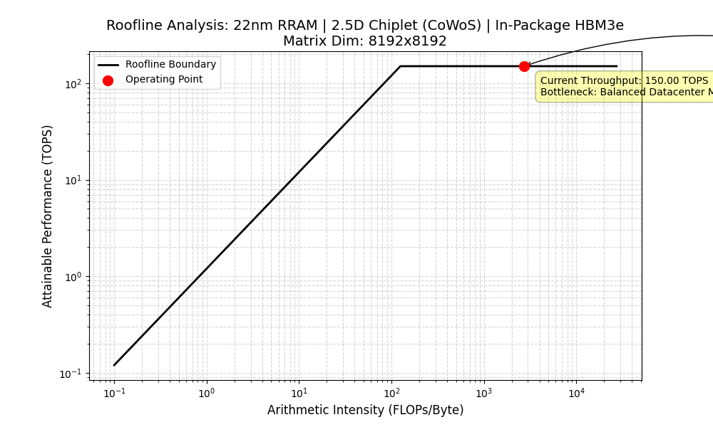

<div align="center">

# 🚀 Project Moonshot
### The Datacenter-Class Analog CIM Architecture

</div>

---

## 🧭 Vision

To take Analog Compute-in-Memory out of the low-power Edge AI space and move it into the high-performance, datacenter-tier arena dominated by NVIDIA, we have to fundamentally change the physics, packaging, and software ecosystem.

Project Moonshot executes on three major vectors:

1. **The Silicon Leap (Advanced Nodes & NVM):** Transitioning from 130nm CMOS charge-sharing to emerging non-volatile memory (NVM) technologies like multi-level RRAM or MRAM integrated directly into a TSMC 22nm or 3nm CMOS back-end-of-line (BEOL).
2. **The Packaging Revolution (Chiplets & 2.5D):** Abandoning the monolithic SoC approach for Advanced Packaging. Analog CIM macros are designed as individual "Chiplets" mounted alongside advanced digital orchestrators and massive High-Bandwidth Memory (HBM3e) stacks on a silicon interposer (e.g. CoWoS).
3. **The Software Wall (The MLIR Compiler):** NVIDIA's moat isn't just silicon; it's CUDA and TensorRT. Project Moonshot focuses on building an LLVM-based compiler stack (MLIR) that takes standard PyTorch code, chunks matrix multiplications, and maps them to physical analog chiplets while automatically applying dynamic body-bias calibrations under the hood.

---

## 📈 The Architectural Interposer Challenge (Roofline Model)

When you transition from a single monolithic chip to a 2.5D chiplet architecture on a Silicon Interposer (like TSMC's CoWoS), you introduce a third variable to the roofline: Die-to-Die (D2D) Interconnect Bandwidth.

The fundamental balancing equation for a matrix multiplication distributed across multiple CIM chiplets is:
$$\text{Arithmetic Intensity} = \frac{2 \cdot M \cdot N \cdot K}{\text{Bytes}_{\text{HBM}} + \text{Bytes}_{\text{D2D}}}$$

If your D2D PHY (Physical Layer) latency or throughput cannot keep pace with how fast your analog arrays calculate partial products, your high-efficiency moonshot will stall.

### 22nm RRAM + 2.5D Chiplet Validation
Using the included `roofline_simulator.py`, we can simulate the bottleneck points for our custom architectures.

<div align="center">
  
</div>

```text
============================================================
        PROJECT MOONSHOT ARCHITECTURAL SIMULATOR RESULTS       
============================================================
Target Configuration: 22nm RRAM | 2.5D Chiplet (CoWoS) | In-Package HBM3e
Workload Footprint:   8192x8192 GEMM Execution
Arithmetic Intensity: 2730.67 FLOPs/Byte
------------------------------------------------------------
Effective Throughput: 150.00 TOPS
System Efficiency:    21.25 TOPS/W
Primary Bottleneck:   Balanced Datacenter Mode: Optimal alignment between high-density analog RRAM compute, D2D interposer channels, and HBM3e throughput.
============================================================
```

---

## 🗂️ Project Structure

This repository is primarily focused on **The Software Wall** — bridging the gap between high-level machine learning frameworks and the physical analog tiles.

```text
Project-Moonshot/
├── compiler/       # The MLIR-based compiler stack
│   ├── mlir-dialects/  # Custom MLIR dialects for Analog CIM operations
│   └── passes/         # Transformation passes for matmul chunking and mapping
├── frontend/       # High-level framework integration
│   └── pytorch_integration.py # Mock PyTorch bindings to intercept standard layers
├── simulator/      # Architectural Simulators
│   └── roofline_simulator.py  # 2.5D Chiplet / Roofline execution bounds simulator
├── docs/           # Generated metrics and plots
└── README.md       # This file
```

---

## 🛠️ Quick Start

**Run the 2.5D Interposer Architectural Simulator:**
```bash
python simulator/roofline_simulator.py
```

**Test the PyTorch Frontend Interception:**
```bash
python frontend/pytorch_integration.py
```

---

## 🌍 The Ecosystem Roadmap

The ultimate goal of Project Moonshot is not just to build a faster chip, but to establish an ecosystem that disrupts the current semiconductor paradigm:

1. **The Linux of Analog AI (Open-Source Standardization):** "Dark silicon" is the biggest problem in analog CIM. By open-sourcing this MLIR-based compiler stack, we provide a unified software standard. Any startup or university designing a custom analog crossbar can plug into this compiler, making Project Moonshot the defacto software orchestrator for the hardware space.
2. **The Silicon Tape-Out & Academic Vanguard:** The simulated math must eventually become physical sand. By taping out the 130nm 8T1C macro on an open-source MPW shuttle, we can measure the actual Signal-to-Noise Ratio (SNR) and energy efficiency (TOPS/W). This end-to-end framework—from MLIR software tiling down to physics-aware RTL masking—is designed to be published in major IEEE ML-hardware conferences.
3. **The Commercial IP Core:** If the silicon tape-out proves our dynamic body-bias calibration and RTL masking crush the analog noise floor, this architecture transitions from an academic project into a highly valuable, licensable piece of Intellectual Property (IP) for the ultra-low-power Edge AI space.
