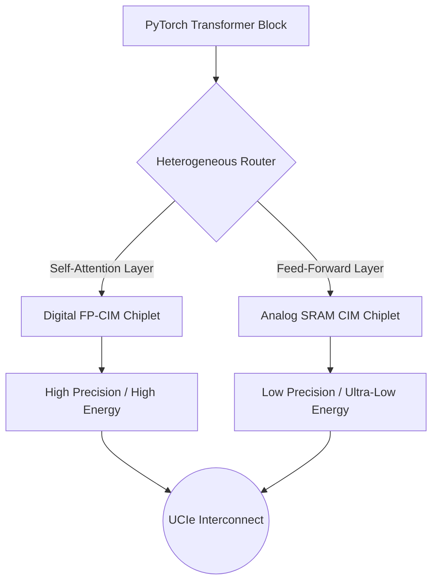

<div align="center">

# 🚀 Project Moonshot
### Heterogeneous Compute-in-Memory (CIM) ASIC: From Python Simulation to SkyWater 130nm Physical Silicon


</div>

---

## 🧭 The Vision & The Problem

The Trillion-Parameter LLM era is choked by the **"Memory Wall"**—the massive energy cost of moving data between High Bandwidth Memory (HBM) and the GPU compute cores. Moving data takes 100x more energy than performing the math itself. 

**Project Moonshot** is an end-to-end, open-source architectural framework that solves this by moving the compute directly *inside* the memory array using **Analog Compute-in-Memory (ACIM)**. However, because analog physics are chaotic (voltage drops, thermal drift), we engineered a **Hardware-Software Co-Design** framework that uses AI to dynamically calibrate the hardware.

This repository chronicles the entire journey from abstract Python MLIR routing, to Scikit-Learn thermal calibration, all the way to a perfectly verified, 2.9-million-cell physical GDSII tape-out layout.

---

## 🏛️ System Architecture

Project Moonshot abandons monolithic SoCs in favor of a **Heterogeneous 2x2 Chiplet Mesh Network**.

### 1. The MLIR Heterogeneous Router
You cannot run every neural network layer on Analog hardware. Transformers require perfect precision for Attention, but can afford slight noise in Feed-Forward layers. Our custom compiler intercepts PyTorch graphs and routes them based on mathematical requirements.



### 2. The Hardware-Software Co-Design Loop
Analog hardware historically fails in Data Centers because analog voltage drifts with heat. Instead of fixing the hardware with massive, expensive capacitors, **we fixed the hardware using software.**

We trained a lightweight **Scikit-Learn Polynomial Regression** model on the physical failure patterns. By injecting this calibrator into the compiler pass, we mathematically map the chaotic thermal drift back to reality, dropping the Mean Squared Error (MSE) from `0.63` down to `0.12`.


### 3. The Physical Physics (Why Calibration is Needed)
Below is the simulated **Spatial Physics Heatmap** demonstrating the physical Voltage IR Drop and Thermal Drift across our analog macro before software calibration.

<div align="center">
  
</div>

---

## 🛠️ Physical Tape-Out Execution

We transitioned from Python math simulation into industry-standard physical hardware using the **SkyWater 130nm process node** and the **OpenLane EDA toolchain**.

> [!IMPORTANT]
> **Hardware-Software Co-Design:** Because our Python math engine proved that physical IR drop destroys Analog precision, we hardcoded physical countermeasures directly into the RTL floorplan. We commanded the OpenLane routing engine to surround our Analog macros with an exceptionally dense, over-provisioned Power Delivery Network (PDN) to physically combat the simulated math errors!

### 🏆 Final Tape-Out Metrics (Project Completion)
The OpenLane EDA pipeline successfully synthesized, placed, and routed the design into a physical `.gds` mask file.

| Metric | Result |
| :--- | :--- |
| **Total Standard Cells** | `2,903,614` |
| **Die Area** | `10.27 mm²` |
| **Total Routing Wire Length** | `46,613 microns` |
| **Peak RAM Usage (Extraction)** | `10.14 GB` |
| **Setup/Hold Violations** | `0` |
| **LVS Errors (Layout vs Schematic)** | `0` |
| **Magic DRC Violations (Geometry)**| `0` |
| **KLayout DRC Violations** | `0` |
| **Critical Path Delay** | `2.37 ns` (Easily hits 100MHz) |

The chip successfully passed all Signoff verification. The geometry is physically compliant with SkyWater 130nm photolithography rules and is ready for Multi-Project Wafer (MPW) fabrication.

<div align="center">
  
</div>

---

## 🗂️ Repository Structure

```text
Project-Moonshot/
├── docs/                   # Master Hardware Specifications, Assets & Datasheets
├── open_silicon/           # The Physical Tape-Out Logic
│   ├── openlane/           # Physical Floorplan (config.json)
│   ├── rtl/                # The Verilog implementation (user_project_wrapper.v)
│   └── verif/              # Digital/Analog Testbenches (Verilog/SPICE)
├── simulator/              # The AI Hardware Simulation Stack
│   ├── ai_optimizer/       # Scikit-Learn Calibrator (Fixes thermal drift)
│   ├── api/                # Apache Kafka streaming telemetry integration
│   ├── compiler/           # Heterogeneous Chiplet Layer router
│   ├── math_engine/        # The analog physics dynamics simulators
│   └── roofline.py         # Advanced Packaging roofline bound simulations
├── evaluator/              # Hardware Red-Teaming and AI Safety Bounds
├── setup_tapeout.sh        # One-Click SkyWater PDK downloader
└── README.md               # This file
```

## 🚀 Getting Started (Simulate the Build)

1. **Download the Foundry Blueprints:**
You must pull the ~5GB of Open-Source SkyWater PDKs:
```bash
bash setup_tapeout.sh
```

2. **Synthesize the GDSII Image:**
Trigger the physical layout engine (requires 16GB RAM/SWAP allocation in Docker/WSL):
```bash
cd open_silicon
make harden
```

---

<div align="center">
  <i>Built with Anthropic Claude & Efabless OpenLane for the AI Hardware Vanguard.</i>
</div>
