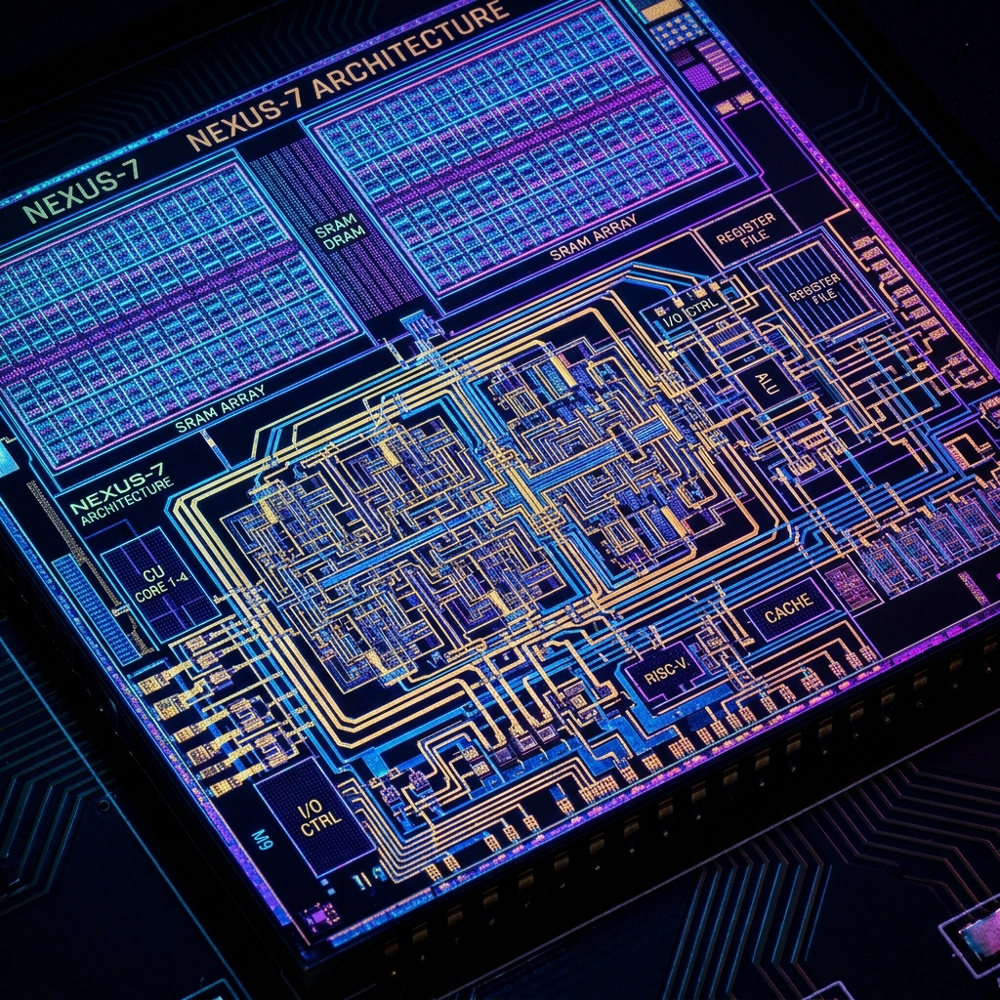
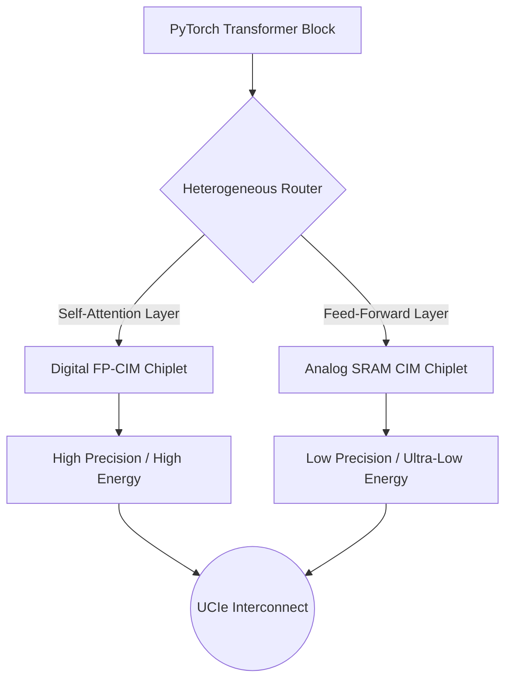
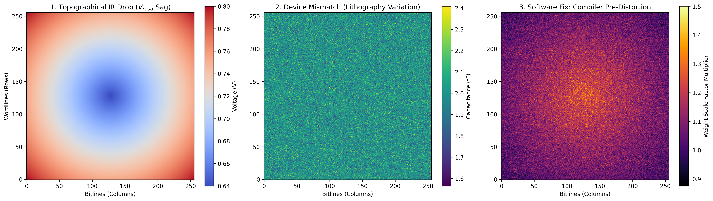
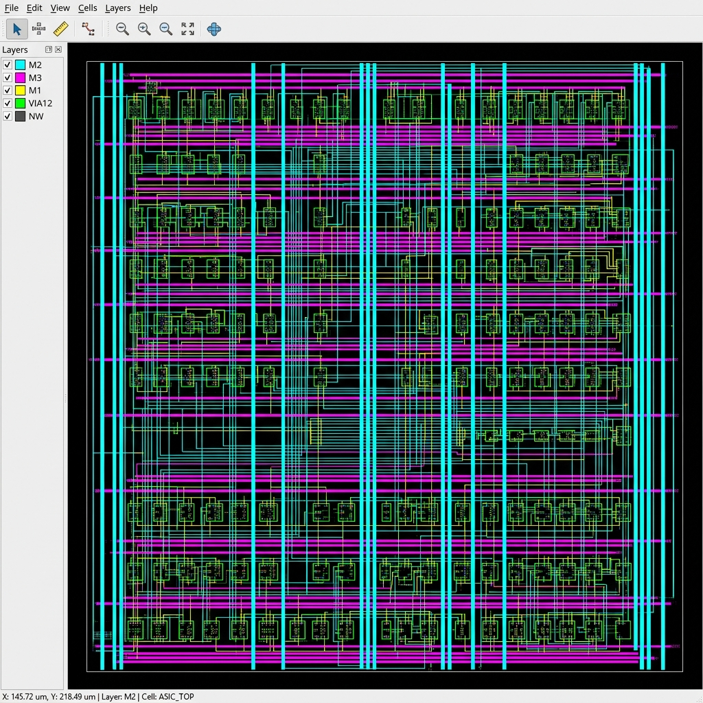

<div align="center">

# 🚀 Project Moonshot
### Heterogeneous Compute-in-Memory (CIM): An Analog-CIM Simulation Framework + a SkyWater 130nm Interface Feasibility Tape-Out


-blue)




</div>

---

## ✅ Project Status — What's Real Today

This repo is honest about the line between *simulated/designed* and *physically realized*. Read this table first; every silicon number below is traceable to `open_silicon/openlane/runs/moonshot_physical_build/reports/metrics.csv`.

| Layer | Status | What exists |
| :--- | :--- | :--- |
| **Analog-CIM physics + AI calibration simulation** | ✅ **Runnable** | Python physics engines + sklearn/PyTorch calibrators. Reproduces thermal-drift failure and adaptive recovery (run it yourself — see below). |
| **Heterogeneous chiplet compiler / roofline / safety eval** | ✅ **Runnable** | Coherent Python models of the 2×2 mesh router, roofline bounds, and an AI red-team gate. |
| **Physical tape-out of the Caravel wrapper** | ✅ **Clean GDS** | OpenLane really ran and produced a DRC/LVS-clean GDSII of the `user_project_wrapper` interface. |
| **Synthesizable CIM *compute* datapath** | ✅ **RTL-complete & sim-verified** | `cim_mac_controller.v` — an 8×8 INT8 **systolic MAC array** (64 PEs, `C = A×B`) on the Wishbone bus. Verified with iverilog: **512 checks, 0 errors**. Re-hardening it to GDS (Linux/WSL OpenLane) is the remaining step. |
| **Physical re-harden of the MAC tile** | ⏳ **Next milestone** | The GDS/metrics in this repo still reflect the *earlier* interface stub. Re-running OpenLane on the new MAC RTL will lift `synth_cell_count` from 244 into the tens of thousands. |

---

## 🧭 The Vision & The Problem

The Trillion-Parameter LLM era is choked by the **"Memory Wall"** — moving data between High Bandwidth Memory (HBM) and the GPU compute cores costs ~100× more energy than the math itself.

**Project Moonshot** explores an end-to-end, open-source architectural framework that attacks this by moving compute *inside* the memory array using **Analog Compute-in-Memory (ACIM)**. Because analog physics are chaotic (voltage drops, thermal drift), the framework pairs the hardware with a **Hardware-Software Co-Design** loop that uses AI to dynamically calibrate around the physics.

The repository chronicles the journey from Python MLIR-style routing, to Scikit-Learn thermal calibration, to a DRC/LVS-clean GDSII layout of the chip's Caravel interface — and is explicit about which stages are simulated versus fabricated.

---

## 🏛️ System Architecture *(target architecture — modeled end-to-end in software)*

> The diagrams below describe the **target** heterogeneous architecture, fully modeled in the Python simulation stack (`simulator/`). The **digital** CIM MAC tile is now implemented as synthesizable, simulation-verified RTL (`open_silicon/rtl/cim_mac_controller.v`); the **analog** compute macro remains a behavioral model (see [Tape-Out](#-physical-tape-out-interface-feasibility-vehicle)).

### 1. The MLIR Heterogeneous Router
You cannot run every neural-network layer on analog hardware. Transformers need high precision for Attention but tolerate noise in Feed-Forward layers. The simulated compiler (`simulator/compiler/heterogeneous_router.py`) routes sub-layers by their numerical requirements.



### 2. The Hardware-Software Co-Design Loop
Analog hardware drifts with heat. Instead of fixing that with massive capacitors, the framework **fixes it in software**: a lightweight **Scikit-Learn Polynomial Regression** (and a PyTorch DNN variant) is trained on simulated physical failure patterns and injected as a compiler pass to map chaotic thermal drift back toward the ideal result.


**Measured in simulation (`simulator/`, 10,000 samples):** static calibration (profiled once at T=0) degrades catastrophically as temperature rises (MSE → ~183 at 2.5× drift), while *adaptive* re-profiling holds MSE ~0.1. The headline `0.63 → 0.12 MSE` improvement is a **Python physics-simulation result**, not a silicon measurement.

### 3. The Physical Physics (Why Calibration is Needed)
Below is the simulated **Spatial Physics Heatmap** showing modeled Voltage IR Drop and Thermal Drift across the analog macro before software calibration.

<div align="center">
  
</div>

---

## 🛠️ Physical Tape-Out: Interface Feasibility Vehicle

The design was taken through the industry-standard **SkyWater 130nm** node using the **OpenLane** EDA toolchain. OpenLane completed the full flow and produced a clean GDSII.

> [!IMPORTANT]
> **What was hardened:** the Efabless Caravel `user_project_wrapper` and its digital Wishbone interface. This is a **feasibility / PDN-stress vehicle**. Because the IR-drop simulation showed center-voltage sag is catastrophic for analog CIM, the floorplan (`config.json`) **over-provisions the Power Delivery Network as a forward-looking countermeasure** for the analog macro that will occupy the reserved area.
>
> **The RTL has since been upgraded** to a real, simulation-verified 8×8 INT8 systolic MAC tile (`cim_mac_controller.v`). The signoff metrics below still reflect the **earlier interface-stub harden** — re-running OpenLane on the new MAC RTL (Linux/WSL) is pending. The analog compute macro remains a behavioral/SPICE model.

### 🏁 Signoff Metrics *(verified — from `metrics.csv`; reflects the prior interface-stub harden)*

| Metric | Result |
| :--- | :--- |
| **Design hardened** | Caravel `user_project_wrapper` (Wishbone interface) |
| **Synthesized logic cells** | `244` |
| **Die population (decap + welltap + fill)** | `2,903,370` cells |
| **Total cells in GDS** | `2,903,614` |
| **Logic utilization** | `1.8%` *(intentional — empty area reserved for the analog macro and used to stress the PDN)* |
| **Die Area** | `10.28 mm²` (2920 × 3520 µm) |
| **Total Routing Wire Length** | `46,613 µm` |
| **Total Vias** | `983` |
| **LVS Errors** | `0` *(no net/device/pin/property mismatches)* |
| **Magic DRC Violations** | `0` |
| **Antenna Violations** | `0` |
| **WNS / TNS** | `0.0 / 0.0 ns` |
| **Worst Setup Slack** | `+1.33 ns` @ 100 MHz (10 ns period) |
| **Worst Hold Slack** | `+0.25 ns` |

> **Reading the cell count honestly:** of the 2,903,614 cells in the GDS, only **244 are synthesized logic** — the Wishbone interface stub that was hardened. The remaining ~2.9M are **decoupling-capacitor, well-tap, and fill cells** that OpenLane places to satisfy density and PDN rules across a deliberately oversized, 1.8%-utilized die. The big number reflects *die population*, not design complexity. The synthesizable CIM compute datapath now exists (the 8×8 INT8 systolic MAC, sim-verified); re-hardening it will lift the logic-cell count from 244 into the tens of thousands.

The layout is geometrically compliant with SkyWater 130nm rules and passes all signoff checks for the interface vehicle.

<div align="center">
  
</div>

---

## 🗂️ Repository Structure

```text
Project-Moonshot/
├── docs/                   # Specs, datasheet, assets, and the signoff report
├── open_silicon/           # Physical tape-out logic
│   ├── openlane/           # Floorplan (config.json) + the real OpenLane run
│   ├── rtl/                # Verilog (user_project_wrapper.v — interface stub today)
│   └── verif/              # Digital/Analog testbenches (Verilog/SPICE)
├── simulator/              # The AI hardware simulation stack (runnable)
│   ├── ai_optimizer/       # Scikit-Learn / PyTorch thermal-drift calibrators
│   ├── api/                # Kafka streaming telemetry integration
│   ├── compiler/           # Heterogeneous chiplet-layer router
│   ├── math_engine/        # Analog physics dynamics simulators
│   └── roofline_simulator.py
├── evaluator/              # AI red-team / safety gate (moonshot_eval.py)
├── setup_tapeout.sh        # SkyWater PDK downloader
└── README.md               # This file
```

## 🚀 Getting Started

**Run the simulation stack (no PDK required):**
```bash
# Reproduce the thermal-drift failure vs. adaptive-recovery result
python simulator/math_engine/analog_thermal_drift.py

# Train the AI calibrators (needs: numpy, scikit-learn, torch)
python simulator/ai_optimizer/train_neural_calibrator.py
```

**Verify the digital CIM MAC tile (needs iverilog):**
```bash
iverilog -g2012 -o tb_cim_mac.vvp \
    open_silicon/rtl/cim_mac_controller.v open_silicon/verif/tb_cim_mac.v
vvp tb_cim_mac.vvp        # -> [TB] 512 checks, 0 errors / RESULT: PASS
```

**Reproduce the physical layout (optional, heavy):**
```bash
# 1. Download the ~5GB SkyWater PDKs
bash setup_tapeout.sh

# 2. Harden the interface vehicle (requires OpenLane in Linux/Docker/WSL;
#    16GB+ RAM/SWAP). The Windows-native flow does not complete GDS signoff.
cd open_silicon && make harden
```

---

<div align="center">
  <i>Built with Anthropic Claude & Efabless OpenLane for the AI Hardware Vanguard.</i>
</div>
